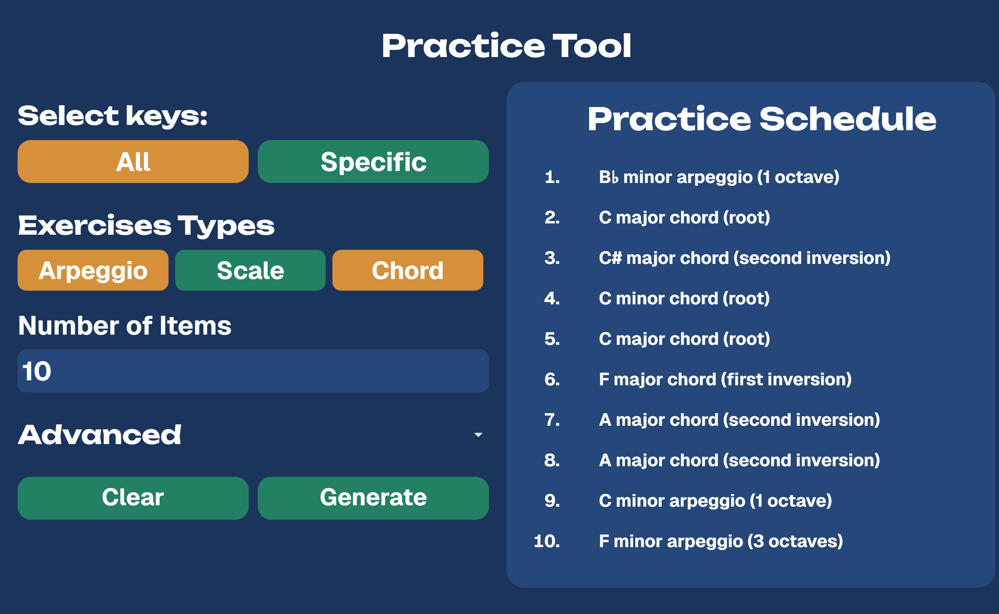
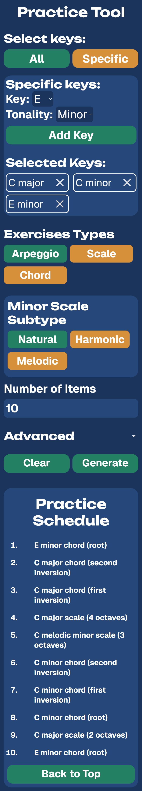

# Music Practice Tool

## Table of contents

- [Overview](#overview)
  - [Screenshot](#screenshot)
  - [Links](#links)
- [My process](#my-process)
  - [Built with](#built-with)
  - [What I learned](#what-i-learned)
  - [Continued development](#continued-development)
  - [Useful resources](#useful-resources)
- [Author](#author)
- [Acknowledgments](#acknowledgments)

## Overview
### Screenshot

### Links

- Live Site URL: [Add live site URL here](https://your-live-site-url.com)

## My process

### Built with

- HTML
- CSS
- JS

### What I learned

I learned how to utilise arrays, both sorting through them and splicing them. This has helped me realise their importance and application in everyday websites through filtering.

### Continued development

In the future, I hope to have a better idea of how to manage my time, especially choosing a realistic tier that I have time to fully complete, instead of adding things as I go. I also hope to build more structure in my code and refactor code from the beginning.

### Useful resources

- [Stack Overflow](https://stackoverflow.com) - Helped with many topics particularly Javascript in which I took some snippets (Labelled).
- [W3 schools](https://www.w3schools.com/) - Helped me in Javascript, espescially the modifying of html or css elements from javascript.
- [MDN Web Docs](https://developer.mozilla.org/) - Helped with the javascript, notably events, and modifying arrays.
- [ChatGPT](https://chatgpt.com/) - Was not in any way reliant but rather used it to get some general guidance when stuck (Not generate code) and do basic things that save time (such as generating the select element for the specific key input)

## Author

- Gabe K

## Acknowledgments

Thank you R.J for the time you put into giving me this project and answering my questions about the project brief. 